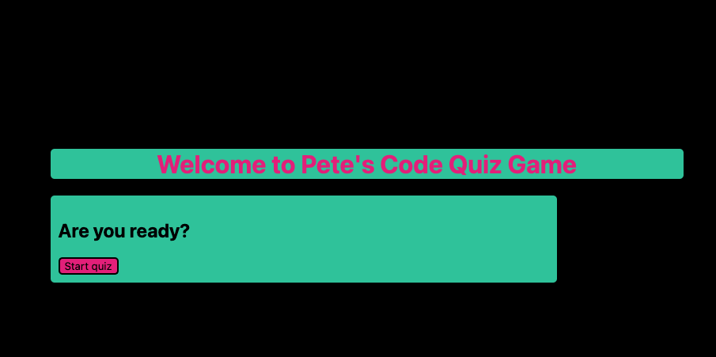
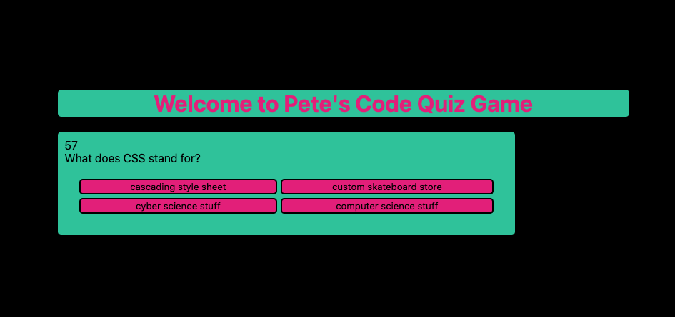
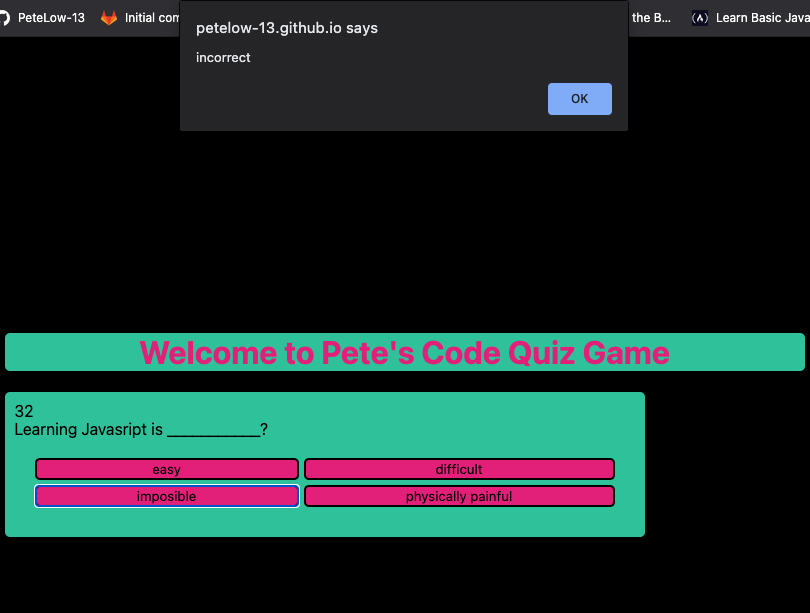
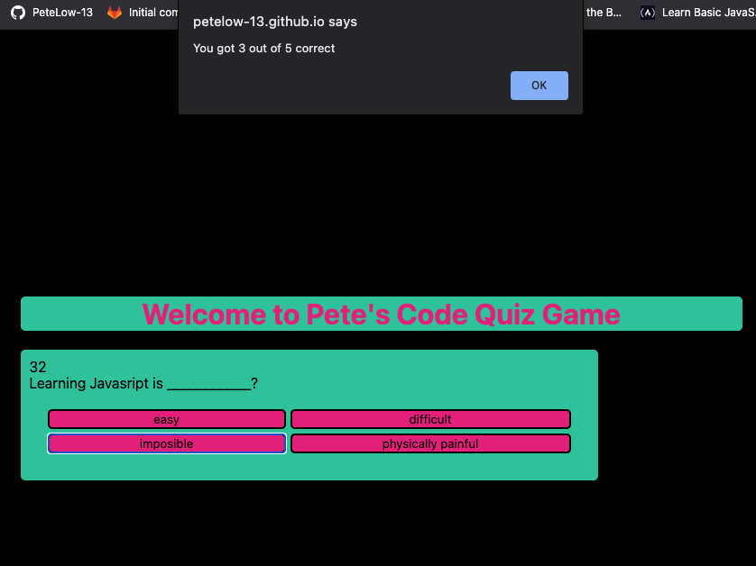
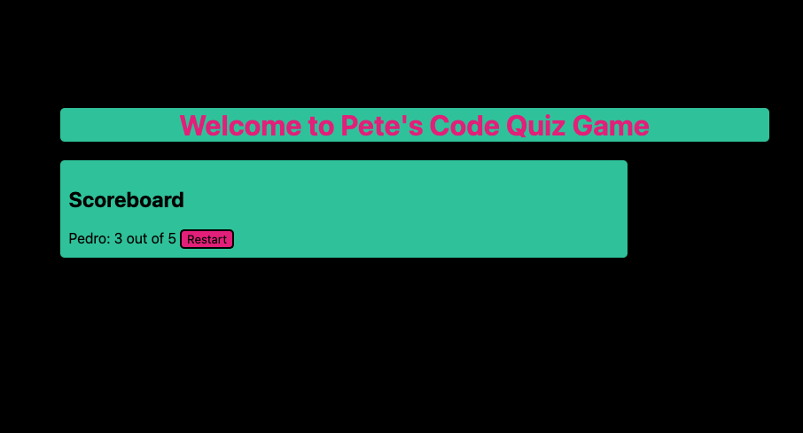

# Code Quiz Game

## Description

When the user clicks start
then questions appear.
When the user selects an answer they are alerted correct or incorrect.
If they are wrong time is deducted and no score is recorded.
If they are correct their score increases.
When all questions have been answered or time runs out the user is told their score and asked for their name.
Then their score is displayed on the score board

## Table of Contents
- [Usage](#usage)
- [Images](#images)
- [Languages](#languages)
- [Repository](#repository)
- [Questions](#questions)

## Usage

Take the Quiz to test your knowledge
## Images

 
 
 
 

## Languages
- [`Java Script`](https://www.javascript.com/)
- [`CSS`](https://en.wikipedia.org/wiki/CSS)
- [`HTML`](https://developer.mozilla.org/en-US/docs/Learn/Getting_started_with_the_web/HTML_basics)

JavaScript, HTML, and CSS were used to build this quiz

## Repository
- https://github.com/PeteLow-13/QuizGame-plow
## Questions

Contact me via email or github with questions
- pedritolow@gmail.com
- [PeteLow-13](http://github.com/PeteLow-13)
